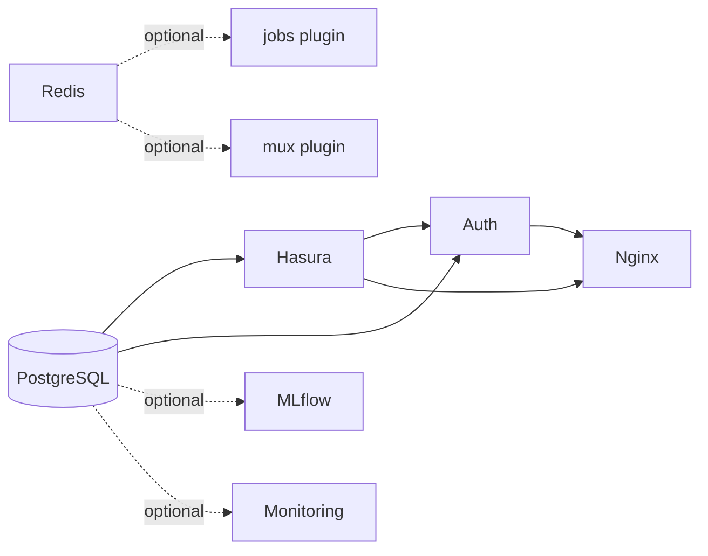

# Service Graph

The ɳSelf stack is composed of a small set of required core services and a growing collection of optional services, plugins, and user-defined custom services. This page documents how those services relate to each other, the order in which they start, and the health checks that gate each transition.

Understanding the dependency graph is useful when debugging startup failures, designing custom services, or reasoning about what breaks when a single service is unhealthy.

---

## Startup Order and Dependency Graph

Services start in dependency order. A service will not start until every service it depends on has passed its health check. The diagram below captures the required and optional dependency edges:



Solid arrows are hard dependencies, Docker Compose `depends_on: condition: service_healthy`. Dashed arrows are soft dependencies that only apply when the relevant optional services or plugins are enabled.

The practical consequence: **PostgreSQL is the root of the dependency tree.** If Postgres does not become healthy, nothing else starts. Hasura and Auth both wait on Postgres independently; Auth Also waits on Hasura because it uses Hasura's metadata API at boot. Nginx is the last core service to start, only after both Hasura and Auth are healthy.

---

## Core Services

These services are always present. They cannot be disabled.

| Service | Image | Internal Port | Health Check | Purpose |
|---------|-------|---------------|--------------|---------|
| PostgreSQL | `postgres:16-alpine` | 5432 | `pg_isready` (interval: 10s) | Primary database for all project data |
| Hasura GraphQL | `hasura/graphql-engine:v2.44.0` | 8080 | `GET /healthz` (interval: 10s) | GraphQL API and metadata engine |
| Auth | `nhost/hasura-auth:0.36.0` | 4000 | `GET /healthz` on port 4000 (interval: 30s) | Authentication , JWT issuance, sessions, OAuth providers |
| Nginx | `nginx:alpine` | 80 / 443 | `GET /health` (interval: 30s) | Reverse proxy, SSL termination, subdomain routing |

All internal services bind to `127.0.0.1`. External traffic reaches them exclusively through Nginx.

---

## Optional Services

Optional services are enabled by setting the corresponding environment variable to `true` in your `.env` file (or `.env.local` for local overrides). When disabled, the service is entirely absent from the generated Compose file, there is no stopped container, no port binding, and no resource usage.

| Service | Toggle | Image | Internal Port | Purpose |
|---------|--------|-------|---------------|---------|
| Redis | `REDIS_ENABLED=true` | `redis:7-alpine` | 6379 | Caching, session storage, job queues |
| Storage (MinIO) | `MINIO_ENABLED=true` | `quay.io/minio/minio:latest` | 9000 (API), 9001 (console) | S3-compatible object storage |
| Email | `MAILPIT_ENABLED=true` | `axllent/mailpit:latest` | 1025 (SMTP), 8025 (UI) | Email testing in development , not for production use |
| Search | `SEARCH_ENABLED=true` | varies | 7700 (MeiliSearch) or 8108 (Typesense) | Full-text search indexing and querying |
| Functions | `FUNCTIONS_ENABLED=true` | `nhost/functions:latest` | 3008 | Serverless function runtime |
| Admin | `NSELF_ADMIN_ENABLED=true` | `nself/nself-admin:latest` | 3021 | Local GUI dashboard |

> **Admin is not a hosted service.** It runs at `localhost:3021` on the developer's own machine and is launched via `nself admin start`. It is never deployed externally, and it is never reachable from outside the machine it runs on.

---

## Custom Services (CS_1..CS_10)

ɳSelf supports up to 10 user-defined services per project. These are declared in your `.env` file using the `CS_N` variable format:

```
CS_N=name:template:port:route
```

For example:

```
CS_1=api:express-ts:3000:api
```

This creates an Express TypeScript service that runs on internal port 3000 and is routed by Nginx at `api.yourdomain.com`.

The `route` field controls the Nginx subdomain that maps to the service. The `template` field selects the scaffold used when `nself service add --template <name>` creates the service directory.

Available templates:

- `go` (default), Go HTTP service
- `node`, Node.js service
- `python`, Python service
- `static`, static file server
- `rust`, Rust service
- `other`, minimal scaffold for anything else

Custom services receive the same Compose health-check wiring and Nginx routing as built-in services. They can declare their own `depends_on` relationships via env vars if they require Postgres or Redis to be healthy before starting.

---

## Monitoring Bundle

When `MONITORING_ENABLED=true`, ten additional sub-services are added to the Compose file as a single coherent observability stack. These services share a dedicated internal network and are accessible through Nginx at `monitoring.yourdomain.com/grafana`, etc., depending on your routing configuration.

| Service | Image | Port | Purpose |
|---------|-------|------|---------|
| Prometheus | `prom/prometheus:latest` | 9090 | Metrics collection and storage |
| Grafana | `grafana/grafana:latest` | 3001 | Dashboard visualization |
| Loki | `grafana/loki:2.9.0` | 3100 | Log aggregation |
| Promtail | `grafana/promtail:2.9.0` | — | Log shipping from containers to Loki |
| Tempo | `grafana/tempo:latest` | 3200 | Distributed tracing |
| Alertmanager | `prom/alertmanager:latest` | 9093 | Alert routing and silencing |
| cAdvisor | `gcr.io/cadvisor/cadvisor:latest` | 8082 | Container-level resource metrics |
| Node Exporter | `prom/node-exporter:latest` | 9100 | Host-level system metrics |
| Postgres Exporter | `prometheuscommunity/postgres-exporter:latest` | 9187 | PostgreSQL metrics |
| Redis Exporter | `oliver006/redis_exporter:latest` | 9121 | Redis metrics (only added if `REDIS_ENABLED=true`) |

The Redis Exporter is conditional: it is only included in the generated Compose file when both `MONITORING_ENABLED=true` and `REDIS_ENABLED=true` are set. This keeps the generated file free of services that have nothing to scrape.

Prometheus is pre-configured with scrape jobs for all enabled exporters. Grafana ships with pre-built dashboards for Postgres, Redis, containers, and the host. No manual dashboard import is required.

---

**See also:** [[Architecture]] | [[Config-System]] | [[Compose-Generation]] | [[Home]]
